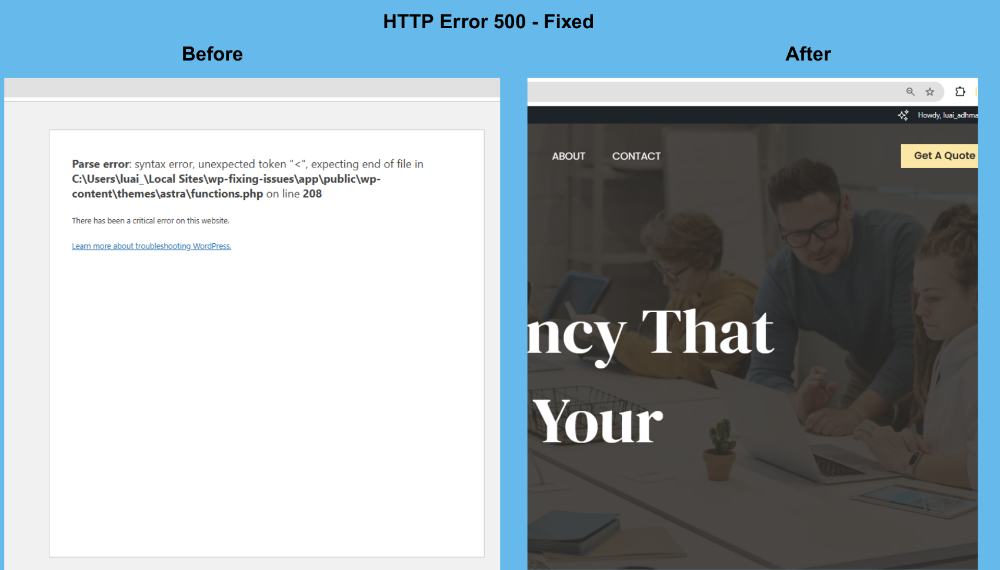
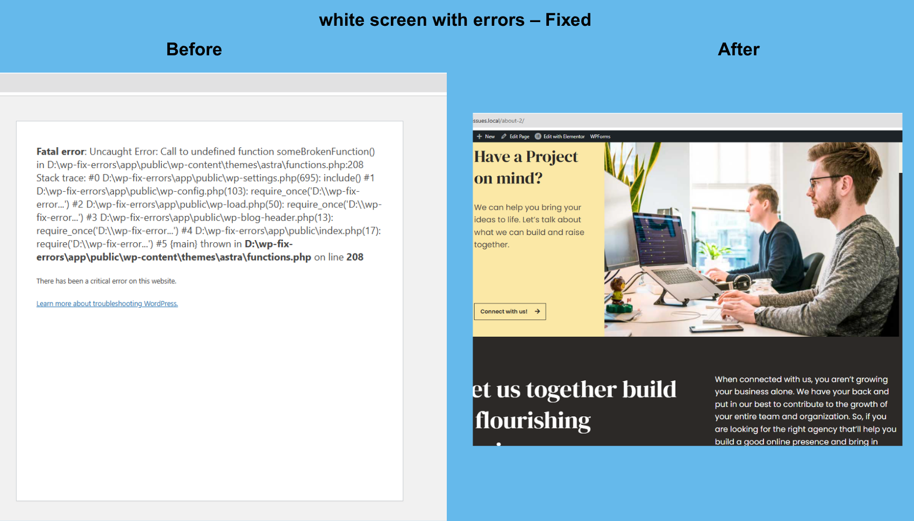
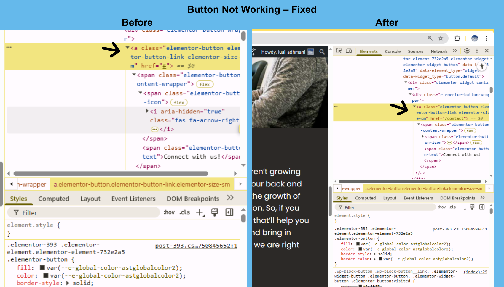
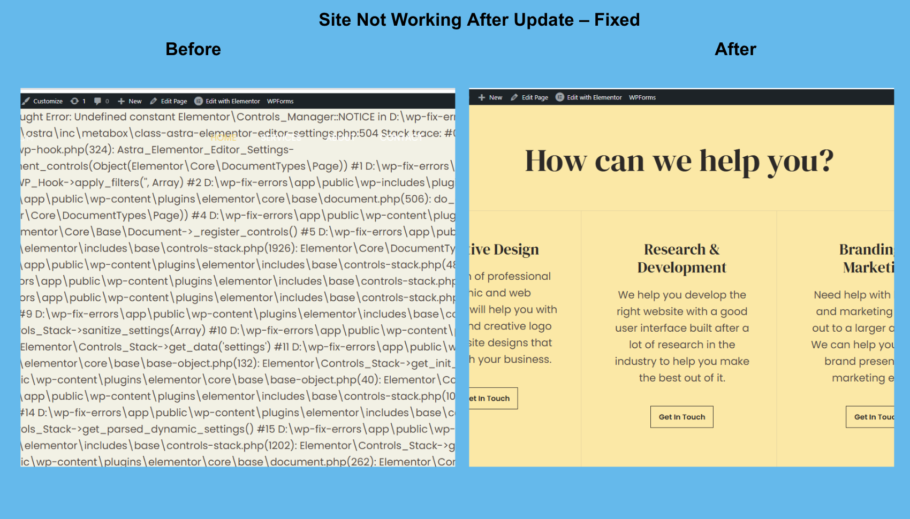
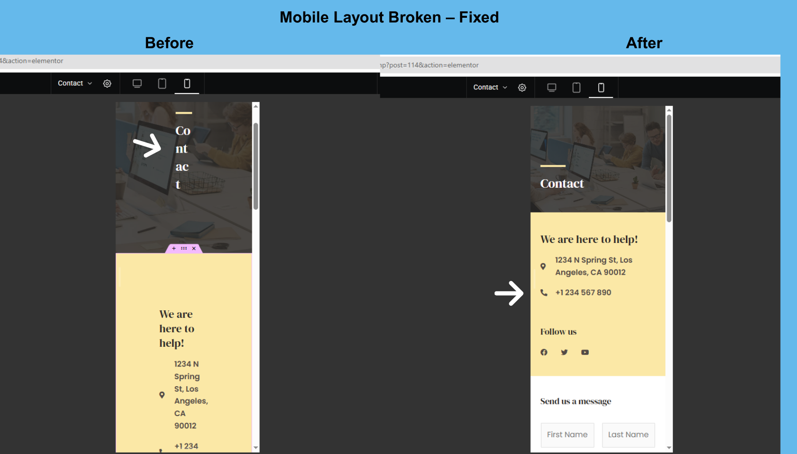

# 🛠️ WordPress Troubleshooting Project

This is my **first WordPress troubleshooting project**, built as part of my learning journey to gain **real freelance or remote work**. It documents actual WordPress issues I recreated and fixed using **LocalWP**, focusing on realistic problems clients face daily.

Each case includes a **before/after screenshot**, a short explanation, and a clear, step-by-step solution. The goal is to build hands-on experience, demonstrate problem-solving skills, and help others who face the same issues.

---

## ✅ Fixed Issues

| # | Issue                           | Status   |
|--:|----------------------------------|----------|
| 1 | HTTP Error 500                  | ✅ Fixed |
| 2 | White Screen of Death           | ✅ Fixed |
| 3 | Button Not Working              | ✅ Fixed |
| 4 | Site Not Working After Update   | ✅ Fixed |
| 5 | Mobile Layout Broken            | ✅ Fixed |

---

## 🧠 Why I Built This

> I believe in **learning by doing**, and this project helped me grow by working on realistic problems.  
> I'm passionate about delivering **high-quality work**, and I'm always ready to help **real clients** — whether through freelance projects or remote jobs.

---

## 🔧 Tools & Methods

- **LocalWP** – Local WordPress testing environment  
- **WordPress Dashboard** – Plugin/theme control and settings  
- **Browser DevTools** – Inspecting layout, CSS, and responsiveness  
- **Plugin Conflict Testing** – Deactivating and testing plugins  
- **Elementor Tweaks** – Layout fixes and visual repairs  
- **Cache Clearing & Permalinks Reset** – Fixing display and routing issues  

---

## 📸 Selected Fixes (Before & After)

### 1. HTTP Error 500  
  
Solved by fixing a syntax error in `functions.php`.

---

### 2. White Screen of Death  
  
Resolved by disabling a plugin causing PHP crashes.

---

### 3. Button Not Working  
  
Fixed by removing a conflicting plugin and updating Elementor settings.

---

### 4. Site Not Working After Update  
  
Solution: plugin rollback and .htaccess file reset.

---

### 5. Mobile Layout Broken  
  
Solved with Elementor responsive controls and custom padding.

---

## 📂 Screenshot Folder

You can find all images in the [`screenshots/`](./screenshots) folder.

---

## 👥 Who This Is For

- Small business owners or bloggers with WordPress issues  
- Freelancers offering debugging services  
- Junior developers learning WordPress troubleshooting  

---

## 📩 Contact

Want me to fix your WordPress issue?  
Message me via [GitHub](https://github.com/luaiadhmani) or connect for freelance/remote opportunities.

---

## 🔖 Tags

`wordpress` &nbsp; `debugging` &nbsp; `elementor` &nbsp; `troubleshooting` &nbsp; `freelance` &nbsp; `remote-work`
