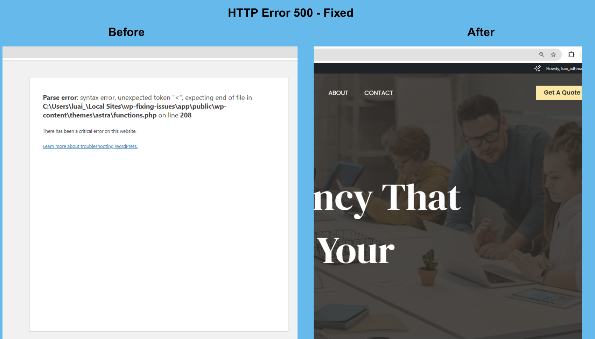

# 🛠️ WordPress Troubleshooting Guide

This project documents **real WordPress issues** I fixed during practical training using LocalWP. Each issue includes **before/after screenshots**, a **clear explanation**, and a **step-by-step solution**. Ideal for showcasing WordPress troubleshooting skills to clients or employers.

---

## ✅ Issues Covered (with Fixes)

| # | Issue Description                         | Screenshot File Name                        | Status   |
|--:|-------------------------------------------|---------------------------------------------|----------|
| 1 | HTTP Error 500                            | `http error 500.png`                         | ✅ Fixed |
| 2 | White Screen of Death                     | `white screen issue.png`                    | ✅ Fixed |
| 3 | Site Not Working After Update             | `Site Not Working After Update – Fixed.png` | ✅ Fixed |
| 4 | 404 Page Not Found                        | `404 Page Not Found – Fixed.png`            | ✅ Fixed |
| 5 | Button Not Working                        | `button not working.png`                    | ✅ Fixed |
| 6 | Form Not Showing                          | `form not showing.png`                      | ✅ Fixed |
| 7 | Header Display Error                      | `header display error – Fixed.png`          | ✅ Fixed |
| 8 | Mobile Layout Broken                      | `mobile layout brocken.png`                 | ✅ Fixed |

---

## 🧰 Tools Used

- 🖥️ **LocalWP** – Local environment for WordPress testing
- 🧩 **Browser Developer Tools** – Inspecting layout and responsiveness
- 🔧 **WordPress Dashboard** – Plugin/theme control, settings
- 🔌 **Plugin Deactivation Testing** – Conflict isolation
- 🧹 **Elementor / Cache Clearing** – Front-end fixes

---

## 🖼️ Example Fix: HTTP Error 500

### 🔍 Before

### ✅ After
Issue fixed after identifying a missing semicolon in `functions.php`. Steps:
1. Accessed files via LocalWP.
2. Located `functions.php` and found a syntax error.
3. Corrected the code and refreshed the site.

---

## 🧠 Purpose of This Project

> To practice and showcase real troubleshooting skills in WordPress by solving common errors in a real test environment. Each issue simulates what clients typically face.

---

## 📂 Screenshots

All images are inside the [`screenshots/`](./screenshots) folder and named clearly to reflect each issue.

---

## 💼 Who This Is For

- Clients needing fast, effective WordPress fixes
- Freelancers looking to offer debugging services
- Developers learning how to resolve real-world issues

---

## 📫 Contact

Need help with your WordPress site?  
Feel free to reach out via GitHub or through my freelance portfolio.
